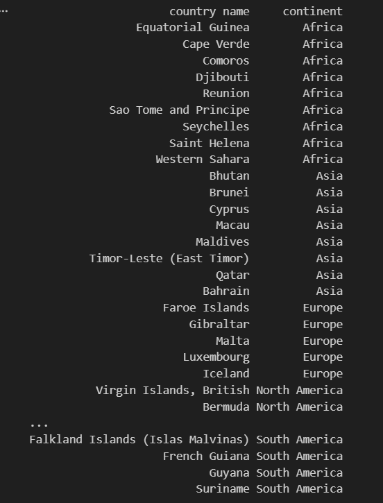
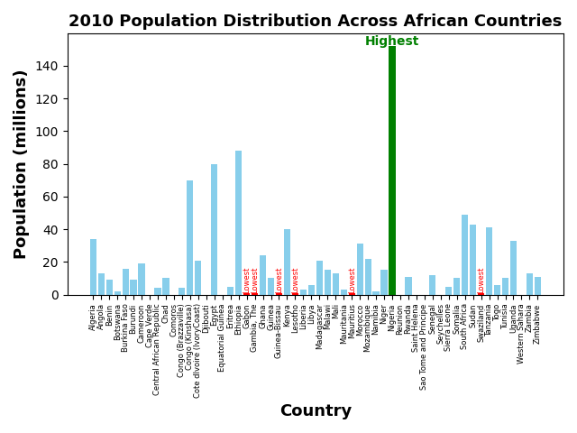
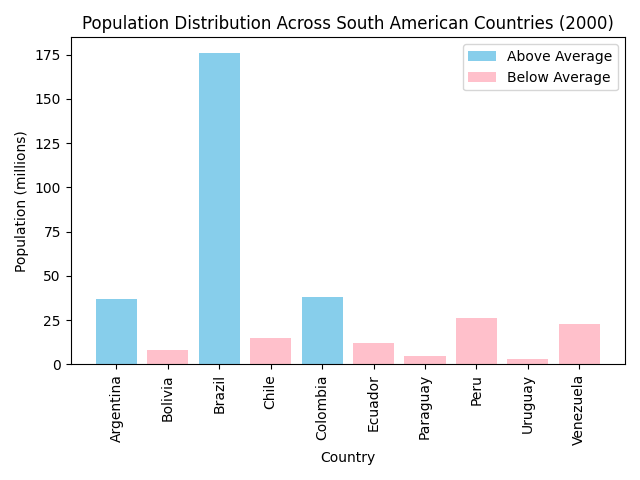
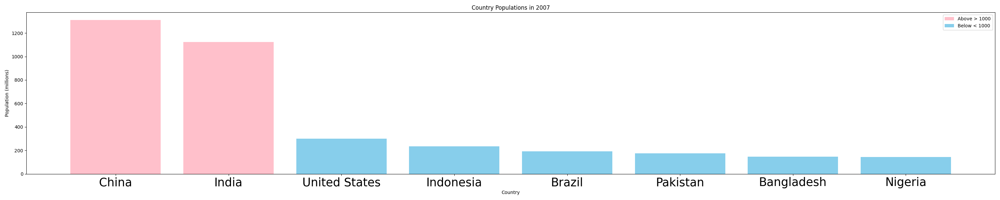
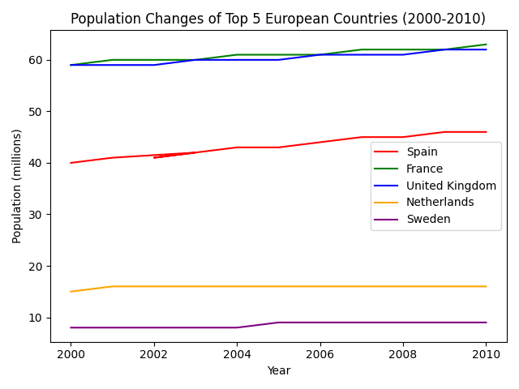

# Population Analysis

## Project overview

## Question 1 How many countries had no recorded population data (0) for the year 2000? List these countries along with their regions.

## Question 2 Calculate the total population for all African countries in 2010. Create a bar chart showing the population distribution across African countries in 2010.

## Question 3 Determine the average population of countries in South America for the year 2000.Highlight countries with populations above and below this average. Include the lists in your analysis.

## Question 4 Identify the countries with populations exceeding 1000 million in 2007. Create a bar chart or scatter plot to display all countries' populations in 2007, marking those above 1000.

## Question 5 Calculate the total population growth in Europe between 2000 and 2010. Identify the top 5 European countries by population growth during this period, and create a line plot showing the population changes of these countries from 2000 to 2010.
 

